# 文件传输系统（支持断点续传与并发）

一个基于 TCP 的 C 语言文件传输系统，支持文件上传、下载、断点续传、并发处理、文件锁保护及日志记录。

## 1.功能特性

- 文件上传与下载
- 断点续传（上传和下载均支持）
- 多客户端并发连接（使用线程池模型）
- 文件锁保护（防止并发上传同一文件导致数据损坏）
- 路径遍历防护（安全检查，拒绝 `..`、`/`、`\` 等危险字符）
- 服务端优雅退出（SIGINT 信号处理）
- 线程安全日志系统（输出到 `server.log`）

## 2.环境要求

- Linux / macOS（支持 POSIX 线程、TCP socket）
- GCC 编译器
- make

## 3.编译与运行

### 3.1编译

make clean
make

#### 编译后生成：

1. bin/server – 服务端

2. bin/client – 客户端

### 3.2运行服务端
    ./bin/server &
    服务端默认监听 8888 端口，文件存储目录为 ./server_files/。

### 3.3运行客户端

1. 上传文件
    ./bin/client upload <filename>

2. 下载文件
    ./bin/client download <filename>

    示例：
        #生成测试文件
        dd if=/dev/urandom of=test.dtxt bs=1M count=100
        ./bin/client upload test.txt
        ./bin/client download test.txt
## 4.断点续传测试
### 4.1上传续传
1. 上传一个文件，中途用 Ctrl+C 中断（或使用 timeout 命令）：
    timeout 2s ./bin/client upload large.bin
2. 再次执行上传命令：
    ./bin/client upload large.bin
    客户端会显示 Server already has X bytes 并从断点处继续上传。

### 4.2下载续传
1. 确保服务端有文件，先完整下载一次文件：
    ./bin/client download large.bin
2. 截断本地文件（模拟下载中断）：
    truncate -s 2M large.bin
3. 再次下载（会自动续传）：
    ./bin/client download large.bin
    客户端会显示 Local file exists, size: X 并从断点处继续下载。
4. 校验文件完整性（与原始文件比较）
    cmp large.bin server_files/large.bin

    md5sum large.bin server_files/large.bin

### 4.3脚本测试断点：断点测试时很快，可使用脚本完成。
1. 断电续传脚本
    resume_test.sh
2. 执行测试
    chmod +x resume_test.sh
    ./resume_test.sh

3. 断点续传测试结果
    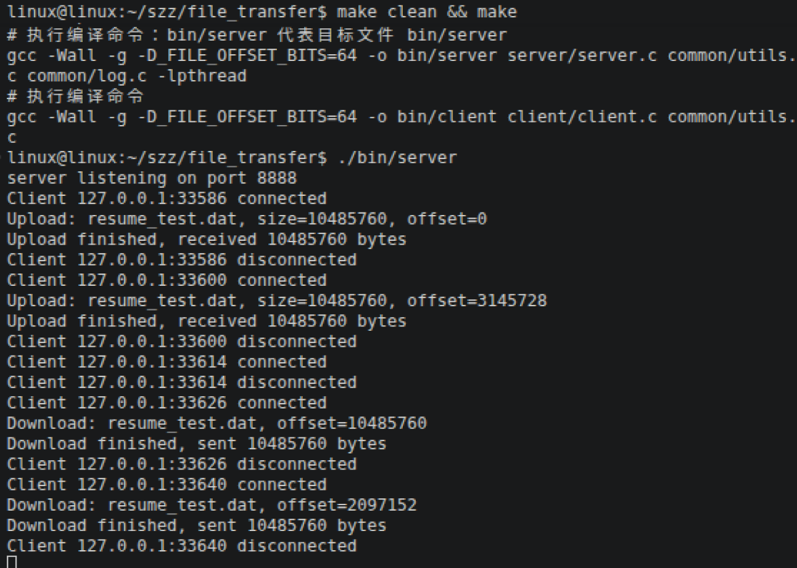
    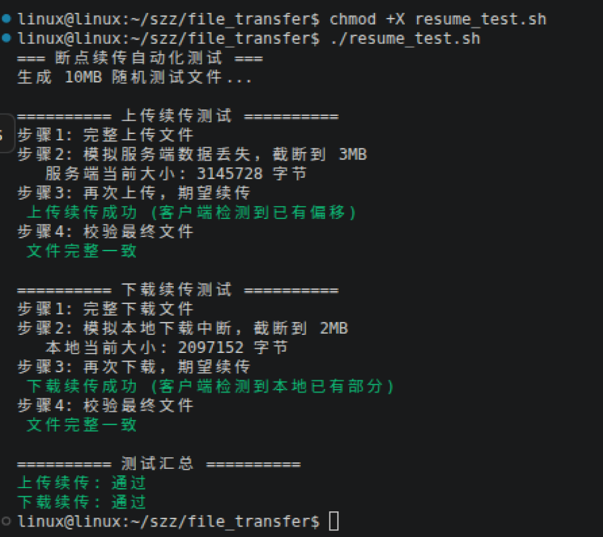

### 4.4并发测试
项目提供了多个自动化测试脚本（位于项目根目录），用于验证并发场景下的正确性。

#### 并发上传
1. 并发上传脚本 
    concurrent_upload_test.sh – 10 个客户端同时上传 5MB 文件
2. 并发上传测试结果
    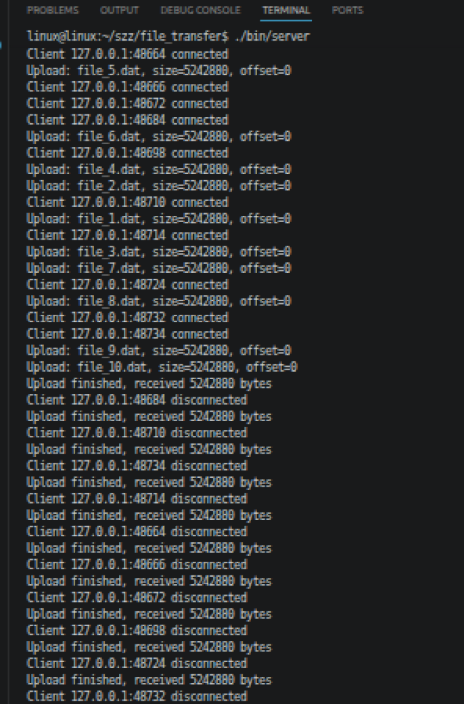
    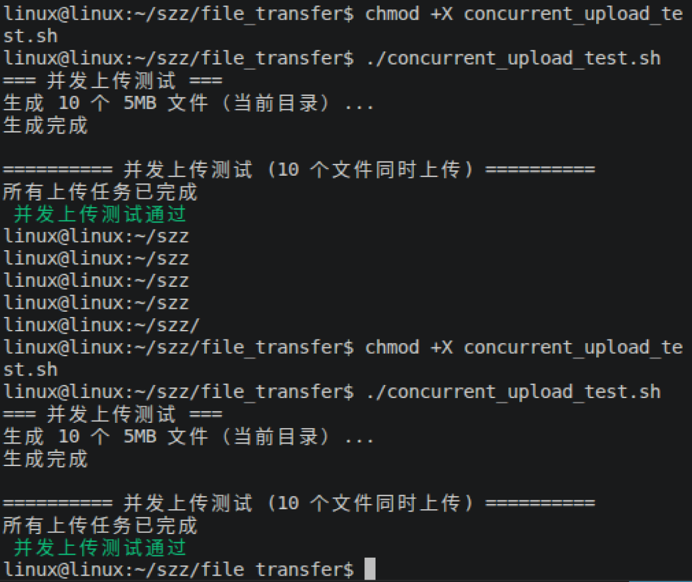

#### 并发下载
1. 并发下载脚本 
    concurrent_download_test.sh – 10 个客户端同时下载 5MB 文件
2. 并发下载测试结果
    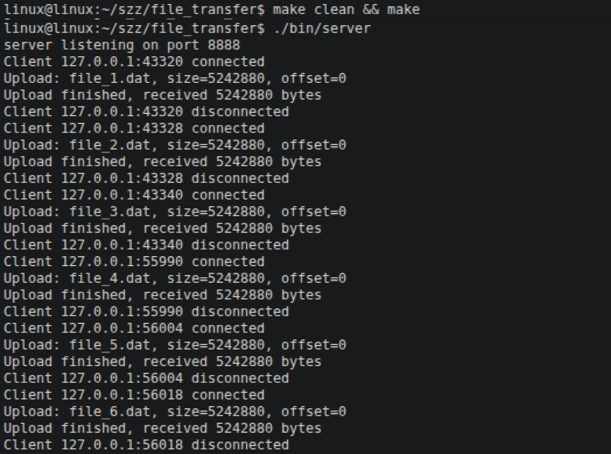
    
    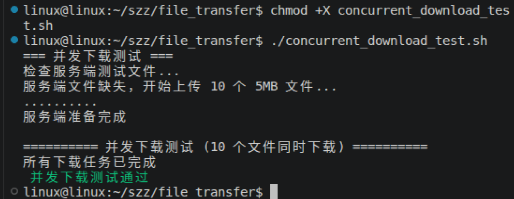

#### 混合并发
1. 混合并发脚本
    concurrent_mixed_test.sh – 5 个上传 + 5 个下载同时进行
2. 混合并发结果
    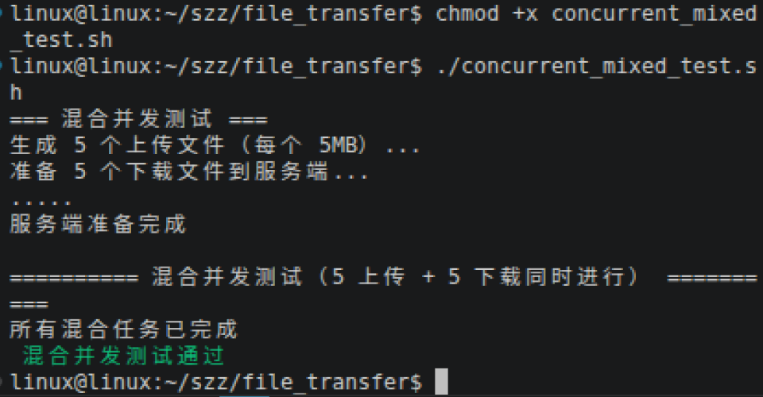

#### 验证禁止多客户端写入同一个文件
1. 测试脚本
    concurrent_same_file_test.sh – 5 个客户端同时上传同一个 10MB 文件（验证文件锁）
2.测试结果
    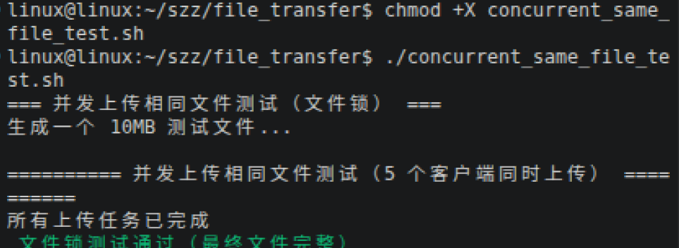

#### 验证所有并发
1. 验证脚本
    run_all_tests.sh – 一键运行上述所有并法测试
2. 验证结果
    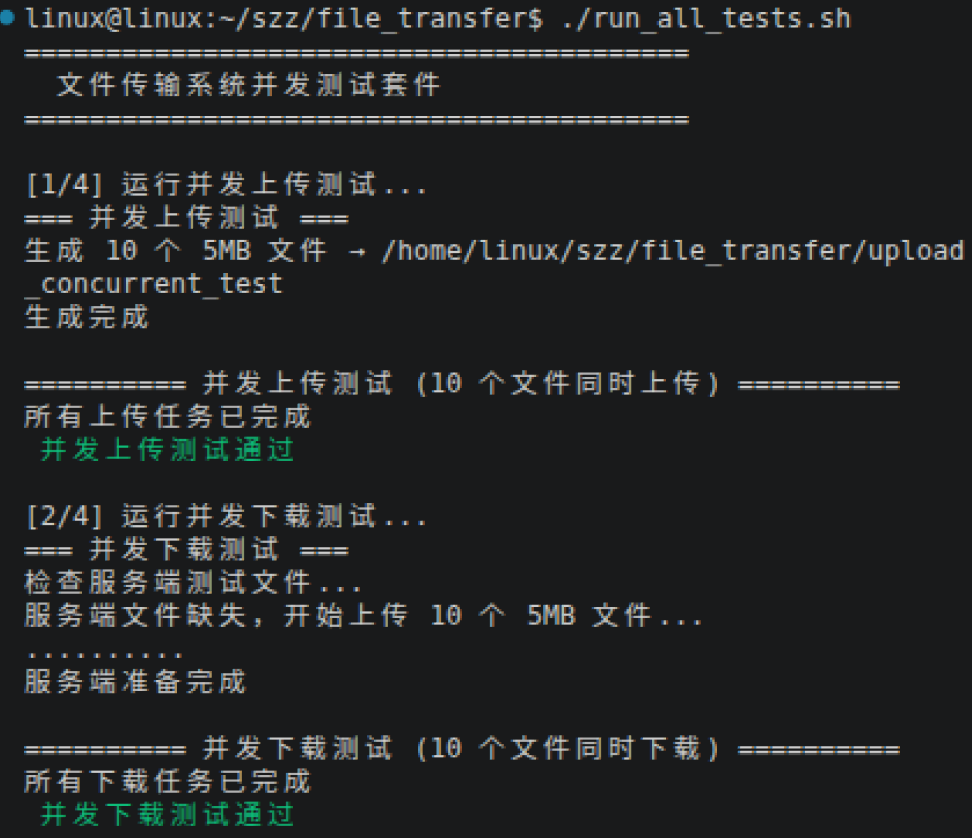
    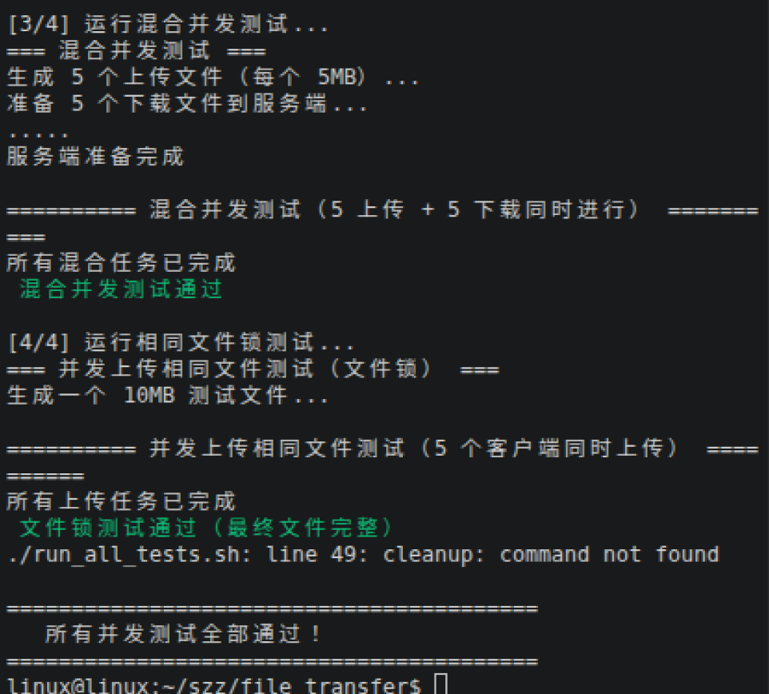

#### 测试并发+断点
1. 验证脚本
    ./mixed_test.sh
2. 验证结果
    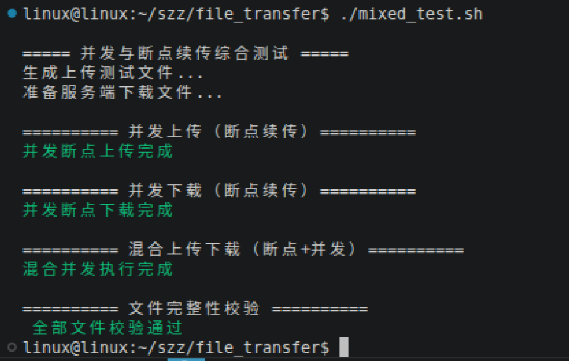

## 5.协议说明
    通信协议为简单的二进制命令+数据格式，定义在 common/protocol.h：

    命令码	含义
    0x01	上传文件
    0x02	下载文件
    0x03	查询文件大小（用于断点续传）
    详细交互流程见源代码注释。

## 6.项目结构
text
.
├── bin/                   # 编译输出目录
├── client/                # 客户端源码
│   └── client.c
├── server/                # 服务端源码
│   └── server.c
├── common/                # 公共模块
│   ├── protocol.h         # 协议定义
│   ├── utils.h / utils.c  # 网络收发与安全检查
│   └── log.h / log.c      # 日志系统
├── server_files/          # 服务端文件存储目录（自动创建）
├── test_ret_img           # 测试截图
├── Makefile
├── server.log
├── run_all_tests.sh       # 所有并发脚本
└── README.md
## 7.注意事项
1. 客户端上传或下载完成后会延迟 1 秒关闭连接，以确保服务端完全接收数据（避免并发时过早关闭导致数据不完整）。如需更优雅的实现，可改用应用层 ACK 确认。

2. 服务端默认最大并发连接数 listen 的 backlog（已设为 128）和系统文件描述符限制。运行前调整 ulimit -n 4096。

3. 日志文件 server.log 会自动创建，记录所有连接、上传、下载及错误信息。

